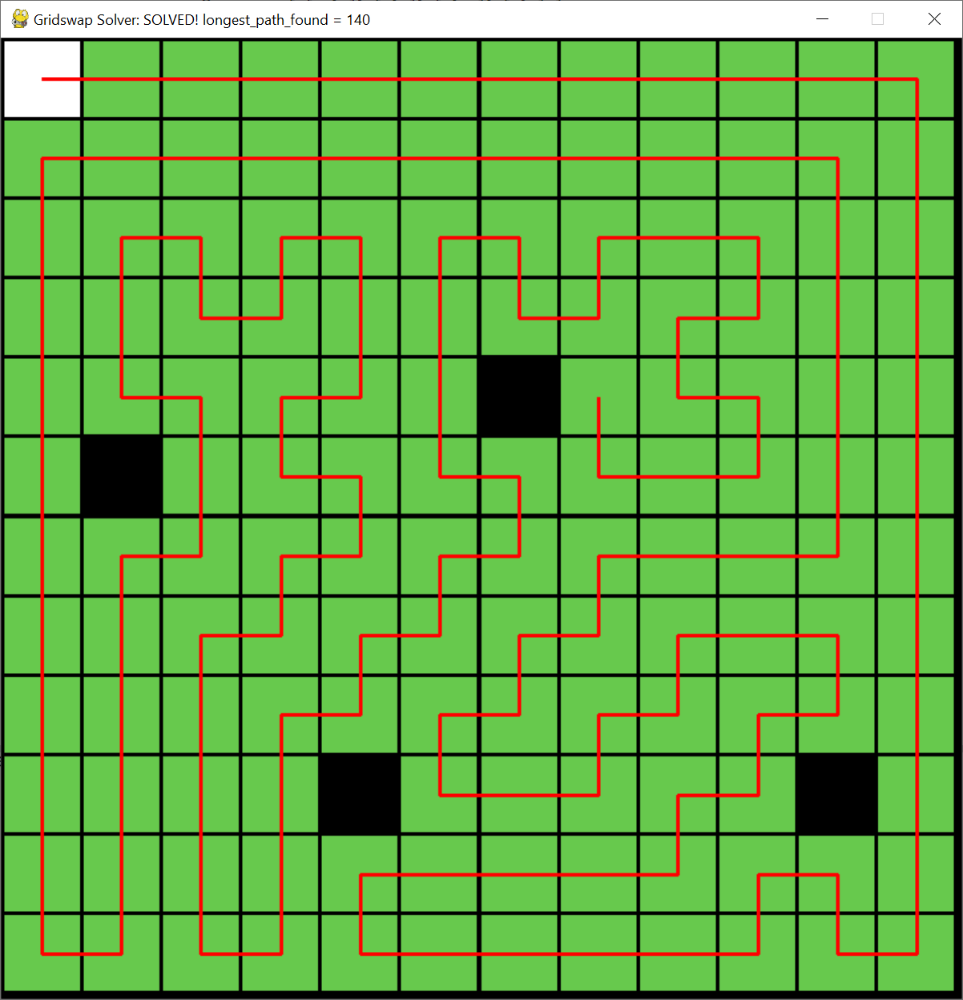
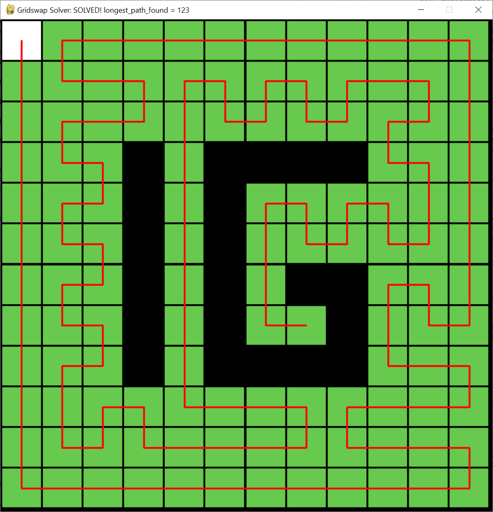

# Gridswap solver in Python

The key features is that it solves any solveable 12x12 grid in under a second, and it has an interactive user interface which allows you to click to select and deselect the black squares, and a solver which shows the path in the window as in the screenshot.

Controls:

Keys:

    Left - Solve
    
    Right - Solve
    
    Space - Solve
    
    R - Reset
    
    Esc - Exit

Use: python i_gridswap.py

Python 3

dependencies: `pip install pygame`

Features:

click on squares on the window to select and deselect black squares

Press space, left or right arrow to solve

Press r to reset

In 99.99% of solveable grids it will solve in under 1 second. Press solve again if it doesn't find a solution.

-------

Pricing: 0.2 ETH (limited sale)

Contact: sargb#1010 on discord

----

Source code will be released in public after game end.

