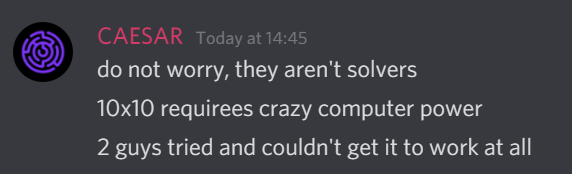

# Gridswap solver in Python

The key features is that it solves any solveable 12x12 grid in under a second, and it has an interative user interface which allows you to click to select and deselect the black squares, and solver which shows the path in the window as in the screenshot.

Controls:

Keys:

    Left - Solve
    
    Right - Solve
    
    Space - Solve
    
    R - Reset
    
    Esc - Exit

Use: python i_gridswap.py

Python 3

dependencies: `pip install pygame`

Features:

click on squares on the window to select and deselect black squares

Press space, left or right arrow to solve

Press r to reset

In 99.99% of solveable grids it will solve in under 1 second. Press solve again if it doesn't find a solution.

# The co-ordinate system

This is the co-ordinate system used in the code. Top left is origin (0,0) and zero-indexed.

# How the solver works

Because this problem is NP-hard, there is no analytical solution which can be used. Instead we can simulate using Monte Carlo method many different paths and through probability and with enough iterations, one of those paths should be the longest possible one. The only problem with this method, is if you're choosing path directions completely at random, it will take a very long time to find the solution.

The key is finding the right algorithm to choose in the path which direction to take. This is the difference between it taking an infinite amount of time, or under a second. Fortunately, over 5 years ago, someone asked about this exact problem on stackexchange (link below) and has a useable heuristic which we can use. The key here is to check the possible neighbours, and use the neighbour which has the least amount of valid neighbours. This means the path should follow and stay close to the edges, and not split the field by going into open areas. Sometimes, there are more than one valid neighbour which fulfils this criteria, in which case one is chosen at random. But a lot of the time, there is only one choice of the next path to take, which reduces the complexity of the problem. This is where the probablistic iterative solver comes into play.

To solve, simply iterate many times the making of the path, and keep storing the longest path each time. If the longest possible path is found, then stop.

A basic extension of this is Markov Chain Monte Carlo method (MCMC), where the path and set of probabilities is stored as a tree, and you can traverse this tree instead of regenerating a new path each time.

The number of iterations is set to 500 by default which should be more than enough to solve any simple 12x12 grid - where there are no black squares on the edges or next to each other. Most are able to be solved in under 20 iterations for 12x12 grid size.

If it does not find a solution, it will instead display the longest path found and "incomplete solution found" in the title bar.

When a full solution is found, is displays "SOLVED!" in the title bar.

The grid size and other parameters can be changed in the code.

The base code is modified from a tutorial found from the internet (link below) and was written in a rush, I have tried tidying it up but it may not be the easiest to understand.

# Information about the general problem

## NP hard

https://en.wikipedia.org/wiki/NP-hardness

## Self-avoiding walk

https://en.wikipedia.org/wiki/Self-avoiding_walk

## Hamilton path in grid graph

https://cs.stackexchange.com/questions/68580/hamiltonian-path-in-grid-graph

This question asked on stackexchange over 5 years ago exactly describes the problem. Underneath, the author adds a comment which is the key to solving it in a reasonable amount of time:

## Monte Carlo Method

https://en.wikipedia.org/wiki/Monte_Carlo_method

## The Chessboard Puzzle and the Mathematics of Invariants

How to tell whether a board is solveable by looking at the placements of the black squares.

https://www.cantorsparadise.com/the-chessboard-puzzle-and-the-mathematics-of-invariants-8283e5b8cdeb

## Basic Pathfinding Explained With Python

Many thanks to the creator of this tutorial, Edaqa Mortoray, which this codebase is a heavily modified version of:

https://www.codementor.io/blog/basic-pathfinding-explained-with-python-5pil8767c1

https://github.com/mortoray/path-finding

## Objectives of gridswap (description from discord)

Once you enter the portal, you will be presented with a grid made up of individual squares. 

Using the arrow keys, you can move from your starting position (the white square) to ‘activate’ other squares which will turn purple. Activate as many squares on the board as possible without moving back over an already activated square or moving into a “black square”. If you activate all the squares on the grid, a new level will begin. You will be able to continue until you fail or time runs out. 

Objective: Activate as many squares as possible before getting stuck (moving to an already activated square or “falling” into a black square)

## Addendum - "internet game"

I did not sell, profit or gain from the making of this script, and nobody gained any advantage from using it during the live game round. Actually, the use of a solver was not a critical factor in getting a high score. Instead, overcoming the low time limit and high risk of human errors due to pressure from only having 2 attempts, and server lag because of "throttling" and/or other external factors, and other server glitches/bugs were the main factors. The increase in grid size from 10x10 to 12x12 and the sparseness of the void spaces also likely simplified the live game round compared to the test rounds.

I enjoyed solving this puzzle, which some said were unsovleable, and where others tried and failed. The challenge of solving interesting problems like this far outweighs any monetary prize. Good luck if you are still participating!

