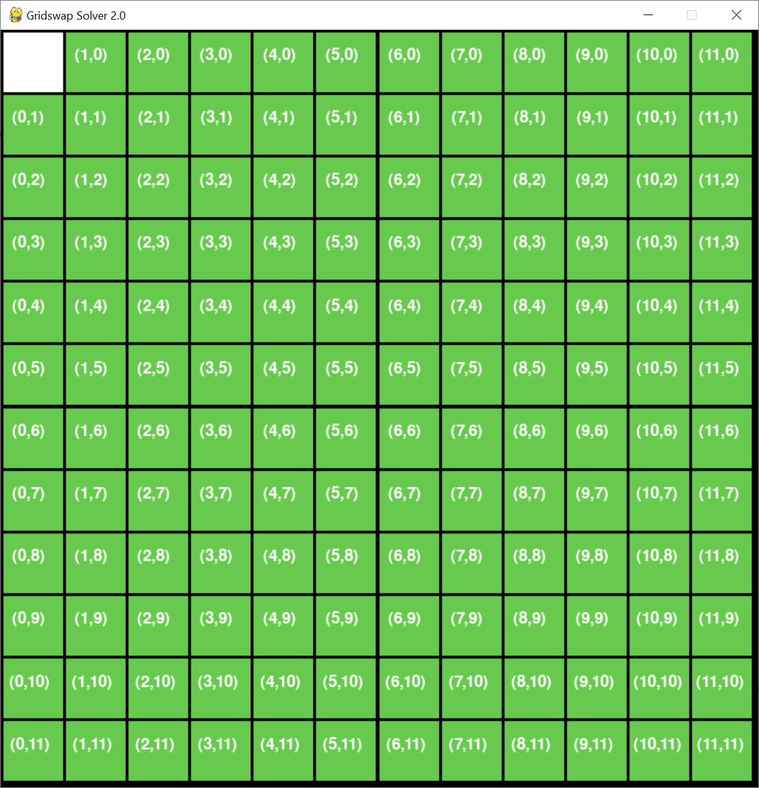
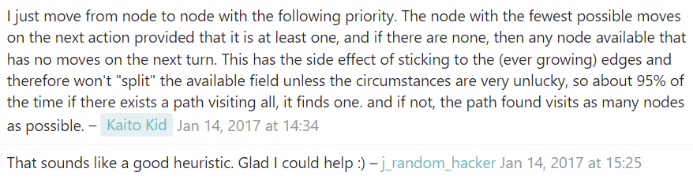

# Gridswap solver in Python

The key features is that it solves any solveable 12x12 grid in under a second, and it has an interative user interface which allows you to click to select and deselect the black squares, and solver which shows the path in the window as in the screenshot.

Controls:

Keys:

    Left - Solve
    
    Right - Solve
    
    Space - Solve
    
    R - Reset
    
    Esc - Exit

Use: python i_gridswap.py

Python 3

dependencies: `pip install pygame`

Features:

click on squares on the window to select and deselect black squares

Press space, left or right arrow to solve

Press r to reset

In 99.99% of solveable grids it will solve in under 1 second. Press solve again if it doesn't find a solution.

# The co-ordinate system

This is the co-ordinate system used in the code. Top left is origin (0,0) and zero-indexed.

# How the solver works

todo...

# Information about the general problem

## NP hard

https://en.wikipedia.org/wiki/NP-hardness

## Self-avoiding walk

https://en.wikipedia.org/wiki/Self-avoiding_walk

## Hamilton path in grid graph

https://cs.stackexchange.com/questions/68580/hamiltonian-path-in-grid-graph

This question asked on stackexchange over 5 years ago exactly describes the problem. Underneath, the author adds a comment which is the key to solving it in a reasonable amount of time:

## Monte Carlo Method

https://en.wikipedia.org/wiki/Monte_Carlo_method

## The Chessboard Puzzle and the Mathematics of Invariants

How to tell whether a board is solveable by looking at the placements of the black squares.

https://www.cantorsparadise.com/the-chessboard-puzzle-and-the-mathematics-of-invariants-8283e5b8cdeb

## Basic Pathfinding Explained With Python

Many thanks to the creator of this tutorial, Edaqa Mortoray, which this codebase is a heavily modified version of:

https://www.codementor.io/blog/basic-pathfinding-explained-with-python-5pil8767c1

https://github.com/mortoray/path-finding

## Objectives of gridswap (description from discord)

Once you enter the portal, you will be presented with a grid made up of individual squares. 

Using the arrow keys, you can move from your starting position (the white square) to ‘activate’ other squares which will turn purple. Activate as many squares on the board as possible without moving back over an already activated square or moving into a “black square”. If you activate all the squares on the grid, a new level will begin. You will be able to continue until you fail or time runs out. 

Objective: Activate as many squares as possible before getting stuck (moving to an already activated square or “falling” into a black square)

